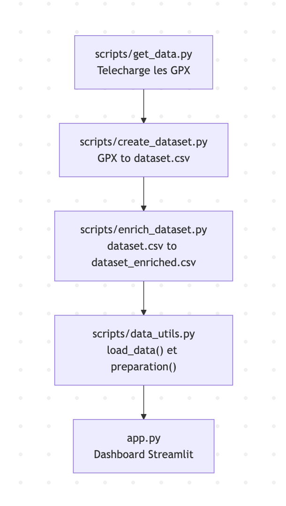

# Projet-dashboard
## Objectif
Ce projet est une version 1 d’une application gratuite permettant d’analyser ses activités sportives (vélo, course, randonnée, etc.) à partir de nos sorties enregistrées sur Strava, Komoot.
L’idée est d’offrir une alternative libre aux plateformes payantes comme Strava Premium ou Veloviewer, en proposant des statistiques et visualisations interactives

## User Guide
### Bibliothèque nécéssaires
Avant de lancer le projet, installez les bibliothèques nécessaires :
```bash
pip install -r requirements.txt
```
### Préparation des données
Les données utilisées proviennent de sorties Strava personnelles, exportées via la fonctionnalité Strava.
Elles sont ensuite traitées et enrichies pour alimenter le dashboard.

Deux méthodes sont possibles:
- Option 1 — Génération complète à partir des traces GPX:
Cette méthode permet de reproduire la création complète du dataset.
    - 1) Téléchargement des traces GPX
Exécutez python scripts/get_data.py
Ce script télécharge les traces utilisées pour cette version et les place dans data/raw/gpx/.
    - 2) Création du dataset brut
python scripts/create_dataset.py
Durée approximative de 3mn selon la machine.
    - 3) Enrichissement du dataset
python scripts/enrich_dataset.py
Le fichier final data/dataset_enriched.csv est alors généré et prêt à être utilisé par le dashboard.

- Option 2 — Télécharger directement le dataset final
Pour éviter le temps de calcul, vous pouvez directement télécharger le fichier prêt à l’emploi :
[lien](https://github.com/TimotheeCrouzet/Projet-dashboard/releases/download/v1.0.0/dataset_enriched.csv)
- Déposez simplement ce fichier dans le dossier : data/
```
Projet-dashboard/
└── data/
    └── dataset_enriched.csv
```
### Lancer le Dashboard
Une fois le fichier data/dataset_enriched.csv disponible (créé ou téléchargé), vous pouvez exécuter l’application Streamlit :
```bash
python main.py
```

### Utiliser le Dashboard
Le Dashboard affiche différentes visualisations interactives :
- Statistiques globales : distance totale, D+, durée cumulée, nombre de sorties, etc.

- Histogramme dynamique de la répartition des activités (type, distance, D+).

- Carte géographique interactive des points de départ ou des traces.

- Filtres dynamiques pour explorer les activités selon le type la distance et même la durée.


## Data
### Origine des données
Les données proviennent de sorties Strava réelles exportées au format GPX, puis publiées en accès libre sur le dépôt GitHub du projet.
Elles peuvent être téléchargées automatiquement grâce au script: 
python scripts/get_data.py

### Structure du Dataset
Le fichier principal utilisé par le Dashboard est : data/dataset_enriched.csv

| Colonne         | Description                       | Type / Unité |
| --------------- | --------------------------------- | ------------ |
| `file_name`     | Nom du fichier GPX source         | Texte        |
| `track_id`      | Identifiant unique de la trace    | Entier       |
| `point_idx`     | Index du point dans la trace      | Entier       |
| `activity_type` | Type d’activité                   | Texte        |
| `lat`, `lon`    | Coordonnées GPS                   | Degrés       |
| `altitude_m`    | Altitude au point                 | m            |
| `distance_m`    | Distance cumulée depuis le départ | m            |
| `dplus_m_cum`   | Dénivelé positif cumulé           | m            |
| `speed_kmh`     | Vitesse instantanée               | km/h         |
| `time`          | Heured UTC du point               | Datetime     |

### Taille et format
- Format : CSV (UTF-8)
- Nombre de colonnes : ~10–15 selon l’enrichissement
- Taille : environ 1 Go 
- version fournie: [lien](https://github.com/TimotheeCrouzet/Projet-dashboard/releases/download/v1.0.0/dataset_enriched.csv)

### Limitations
- Les données représentent un échantillon de sorties personnelles, non une base publique.
- Le dataset est optimisé pour une utilisation locale, pas pour un hébergement en ligne.


## Developer Guide
### Structure du code
Le projet est organisé en plusieurs scripts, chacun ayant un rôle précis dans la préparation et la visualisation des données.
Organisation du code:
```
Projet-dashboard/
├─ data/
│  ├─ raw/gpx/               # Traces GPX (pipeline complète)
│  ├─ dataset.csv            # Créé par scripts/create_dataset.py
│  └─ dataset_enriched.csv   # Créé par scripts/enrich_dataset.py
├─ scripts/
│  ├─ get_data.py            # Télécharge les GPX publics
│  ├─ create_dataset.py      # GPX -> dataset.csv (point par point)
│  ├─ enrich_dataset.py      # Nettoyage + enrichissements -> dataset_enriched.csv
│  └─ data_utils.py          # Prépare les données (load_data, preparation)
├─ app.py                    # Dashboard Streamlit
├─ main.py                   # Lance Streamlit (run app.py)
├─ requirements.txt
└─ README.md
```


### Flux de traitements des données


### Lancer le Dashboard
```bash
python main.py
```

### Ajouter une page ou un graphique
Ajouter un nouveau graphique:
- 1) Ouvrir app.py.
- 2) Utiliser summary ou raw_points, ces 2 Dataframe sont importées depuis scripts/data_utils.py
- 3) Créer un graphique avec Plotly Express :
```python
import plotly.express as px
fig = px.scatter(summary, x="total_distance_km", y="total_dplus_m",
                 color="activity_type", title="Distance vs D+")
st.plotly_chart(fig, use_container_width=True)
```
- 4) Ajouter un titre clair et une section dans l’application Streamlit.

Ajouter une page:
- 1) Créer un dossier pages/ à la racine du projet
- 2) Ajouter un fichier Python, par exemple pages/01_Statistiques_détaillées.py
- 3) Relancer le dashboard. La nouvelle page apparaîtra automatiquement dans le menu Streamlit.

## Rapport d’analyse
### Objectif
L’objectif de ce projet n’est pas de produire une étude statistique approfondie, mais de proposer une visualisation agréable et interactive des activités sportives enregistrées sur Strava.
Le dashboard permet à tout utilisateur: cycliste, randonneur ou coureur, de revoir ses sorties, explorer ses trajets, et suivre ses chiffres clés (distance, D+, durée) de façon ludique.

## Une vision globale de ses sorties
Grâce à la carte interactive et aux graphiques, l’utilisateur peut visualiser :
- 1) Les zones géographiques les plus fréquentées (lieux de départ, parcours habituels)
- 2) La répartition des types d'activités
- 3) La distribution des distances ainsi que des dénivelés
- 4) La carte des activitées

## Évolutions possibles
Dans des versions plus avancées, plusieurs extensions sont envisageables :
- Comparer les statistiques de plusieurs utilisateurs (par exemple, une famille ou un groupe de randonneurs)
- Ajouter un classement amical ou un suivi d’évolution dans le temps
- Intégrer des heatmaps globales pour visualiser les zones les plus explorées

## Conclusion
Cette version 1 montre qu’il est possible, à partir de simples fichiers GPX Strava, de créer une interface claire, interactive et agréable pour visualiser ses activités sportives.
L’intérêt du projet repose avant tout sur le plaisir de la donnée : transformer ses sorties en une expérience visuelle et motivante, sans contrainte ni abonnement.

## Copyright
Je déclare sur l’honneur que l’ensemble du code fourni dans ce projet a été rédigé par moi-même, à l’exception des lignes explicitement mentionnées ci-dessous:

| Fichier                     | Lignes concernées                                                                | Source / Outil | Explication                                                                                                                                                                            |
| --------------------------- | ------------------------------------------------------------------------------------ | -------------- | -------------------------------------------------------------------------------------------------------------------------------------------------------------------------------------- |
| `scripts/enrich_dataset.py` | Bloc de conversion de dates :<br>`if str(df["time"].dtype) == "datetime64[ns]": ...` | ChatGPT        | Ce bloc m’a été suggéré pour corriger un problème de fuseau horaire lors du traitement des timestamps. Il convertit les dates en UTC puis en heure locale (Europe/Paris).              |
| `scripts/create_dataset.py` | Quelques corrections mineures de syntaxe (boucles, indentation, agrégations Pandas)  | ChatGPT        | ChatGPT m’a aidé ponctuellement à **débugger** des erreurs de syntaxe et de typage, sans générer le code complet.                                                                      |
| Global                      | Suggestions de complétion automatique                                                | GitHub Copilot | Copilot a été utilisé comme **aide à la saisie** pour des portions de code répétitives (par ex. création de colonnes, boucles). Aucun bloc complet n’a été copié d’une source externe. |
